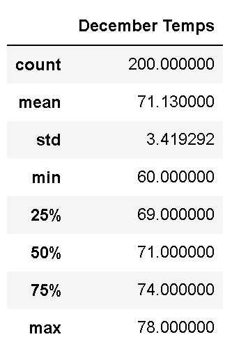

# Surfs Up Analysis

## Overview:

The purpose of the analysis is to determine if the surf and ice cream shop business is sustainable year-round.

### Results:

The weather between June and December differs in the following ways:

- The mean temperature in June is 77 and 71 in December
- The range of temperature in december is wider (28 degrees) than in June (12 degrees)
- The st. dev. was 3.4 degrees in December and 2.62 in June

### Summary:

We can determine from the results that it is warmer in June than it is in December and there is less variability in the temperature in June than in December. 

Additionally, to gather more weather data for June and December, we could run a couple more queries. We could find out the variability between station locations and we could also perform a high level inquiry to look at the variability across each month to find out which specific location is best suited for the business.
